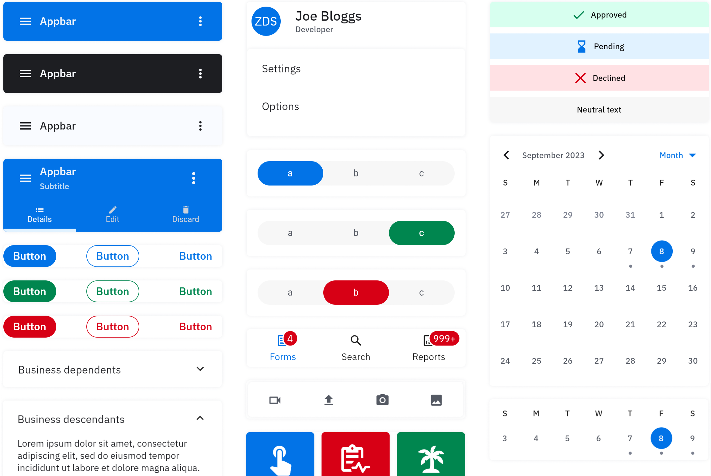

# ZDS Flutter

A library of Flutter components made by Zebra Technologies based on the Zebra Design System, or ZDS.
<a href='https://zds-c9c24.web.app/'>
<picture>

  <source media="(prefers-color-scheme: dark)" srcset="doc/assets/zds-dark.png">
  
</picture>
</a>

## Requirements

Make sure your app meets the following requirements before using ZDS Flutter

- sdk: >=3.2.0 <4.0.0
- flutter: >=3.16.0

## Usage

Add the following as a dependency in your pubspec.yaml file.

<!--x-release-please-start-version-->

```yaml
zds-flutter: ^1.2.4
```

<!-- x-release-please-end -->

## Getting started

### Template

To speed up development, we have a template repo with ZDS Flutter already set up: [zds_flutter_template](https://github.com/ZebraDevs/zds_flutter_template)

### Manual setup

In order to use components from ZDS Flutter, you must change your app widget to be a `ZdsApp`

```dart
class DemoApp extends StatelessWidget {
  const DemoApp({Key? key}) : super(key: key);

  @override
  Widget build(BuildContext context) {
    return ZdsApp(
      title: 'ZDS Flutter demo',
      routes: kAllRoutes,
    );
  }
}

```

## Viewing the components

To view examples of all the components in the library, you can run the example app in this repo or go to [this link](https://zds-c9c24.web.app/).

## Theming

The ZDS uses the color system from another Zebra design library - [zeta_flutter](https://pub.dev/packages/zeta_flutter).

---

## Platform support

Full support on Android and iOS.

On Web, Windows, Mac and Linux some features may be missing, but most functionality remains.

## Licensing

This software is licensed with the MIT license (see [LICENSE](./LICENSE)) and uses some components that are distributed under their own terms (see [LICENSE-3RD-PARTY](./LICENSE-3RD-PARTY)).

---

### Future project Todos:

[ ] Add [Widgetbook](https://pub.dev/packages/widgetbook).

[ ] Fix untranslated strings - see `untranslated.json`.

[ ] Set up themes to inherit from parent classes - think of toolbar within bottom of appbar.

[ ] Integrate ZetaColors better.

[ ] Analyze dependencies for weaknesses, possibly phase out some.

[ ] Remove code from this repo that is not strictly needed for flutter - github actions could be in another repo?
